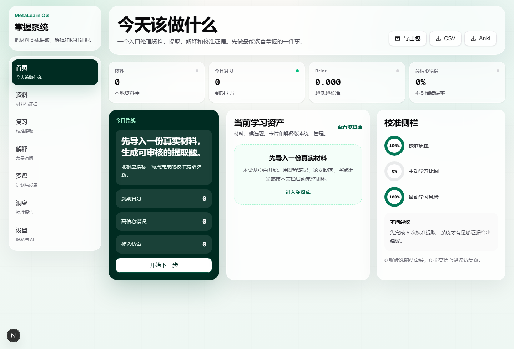
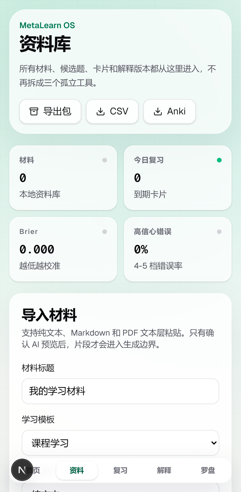

# MetaLearn OS

MetaLearn OS is a local-first learning app for turning real study materials into retrieval practice, Feynman explanations, calibration feedback, and lightweight learning insights.

It is built for learners who want to study with evidence rather than with vague feelings of familiarity. The product does not claim to improve intelligence or guarantee learning outcomes. It helps users run better learning behaviors: active recall, confidence calibration, source-grounded feedback, explanation repair, and low-friction reflection.





## Why This Exists

Most study tools optimize for storing notes, generating summaries, or scheduling tasks. MetaLearn OS takes a narrower position:

- Real learning evidence comes from what the learner can retrieve, explain, and correct.
- Confidence should be predicted before feedback, otherwise calibration cannot be measured.
- AI should not quietly replace thinking. It can propose cards, ask questions, or draft reports, but the learner must review, reject, revise, and connect the evidence.
- Privacy matters because learning materials, errors, and self-assessments are sensitive. The MVP is local-first, exportable, and restorable from local JSON packages.
- Metacognition can become overhead. Planning, check-ins, and reflection must stay lightweight.

## Product Surface

The active app is `apps/metalearn-os`, a unified product with six workspaces:

- `首页`: today's next best action, due reviews, high-confidence errors, pending candidates, and calibration indicators.
- `资料库`: materials, chunks, candidate questions, approved cards, explanations, and source-grounded assets.
- `校准记忆`: confidence prediction, active answer, self-rating, source reveal, calibration gap, and review scheduling.
- `费曼解释`: explanation attempts, three Socratic questions, rubric scores, version history, gap tags, concept nodes, and card handoff.
- `学习罗盘`: 60-second plan, low-frequency check-ins, 2-minute reflection, prediction-vs-actual tracking, and deterministic daily advice.
- `洞察报告`: Brier score, overconfidence, high-confidence error rate, passive-learning risk, weak tags, tag-level overconfidence, and explanation gap types.
- `设置与隐私`: local AI mode, export/restore boundaries, CSV/Anki download, privacy contract, and local data deletion.

The older three apps are retained as legacy module references:

- `apps/calibrate-memory`
- `apps/learning-compass`
- `apps/feynman-workshop`

New product work should land in `apps/metalearn-os` first.

## Current Beta Scope

Implemented:

- local-first PWA-style Next.js app;
- text and Markdown paste or file import, plus selectable text-layer PDF file extraction;
- visible material import stages, text-quality checks, and candidate-generation diagnostics;
- automatic chunking;
- material reader workbench with chunk focus, evidence coverage, and source-to-card actions;
- active reading track that prioritizes uncovered chunks, pending candidates, carded-but-unreviewed chunks, and reviewed evidence;
- AI upload preview before any generation request;
- local mock AI provider by default;
- source-grounded candidate card generation;
- candidate review with edit, approve, reject, and bulk approve;
- review flow with hidden source, confidence 1-5, active answer, self-rating, source reveal, and calibration feedback;
- strict review state machine that prevents skipping confidence prediction or active answer entry;
- review keyboard shortcuts: `1-5` for confidence, `A/P/C/E` for wrong, partial, correct, easy, and `N` for next card after feedback;
- global command palette with `Ctrl/Cmd+K` for navigation, review, repair, import, export, and privacy actions;
- home study mode launcher for import, calibration review, mistake repair, Feynman explanation, and planning;
- high-confidence error repair tasks at `/review/mistakes`;
- simplified FSRS adapter interface;
- Feynman explanation versions, gap tags, rubric trend, concept nodes, and confirmed concept edges;
- explanation-to-card handoff;
- lightweight learning sessions, check-ins, reflections, and prediction bias;
- insight snapshots and deterministic recommendations;
- JSON export and restore package with manifest, local preflight validation, and conflict handling;
- CSV and Anki TSV export;
- one-step data export and two-step local deletion;
- desktop and mobile E2E coverage.

Material import has an explicit reliability contract:

- choosing a PDF/TXT/Markdown file only reads text into the local editor; it does not create a material record;
- `保存并生成候选题` first saves the source and chunks locally, then creates an AI upload preview;
- candidate generation uses the chunk snapshot captured by the preview, so it does not depend on delayed React state refreshes;
- generated cards remain candidates until the learner edits, rejects, or approves them;
- PDFs must have a selectable text layer. Scanned PDFs are rejected with an OCR limitation message instead of failing silently;
- if generation fails, the saved material remains available and the user can create cards manually from source chunks.

Out of scope for the current beta:

- accounts;
- cloud sync;
- payment or subscription;
- collaboration;
- native mobile apps;
- OCR for scanned PDFs;
- voice explanation;
- full graph editor;
- community features;
- AI acting as a fact judge.

## Architecture

This repository is a TypeScript monorepo.

```text
apps/
  metalearn-os/          Unified product app
  calibrate-memory/      Legacy standalone review app
  learning-compass/      Legacy standalone planning app
  feynman-workshop/      Legacy standalone explanation app
packages/
  core/                  Shared product types and learning templates
  ui/                    Shared UI primitives and product shell
  storage/               IndexedDB/Dexie storage, export, import helpers
  ai/                    Schema-checked mock AI contracts and prompt boundaries
  learning-science/      Calibration metrics, queue logic, scheduling adapter
tests/
  e2e/                   Playwright desktop and mobile flows
docs/
  assets/                README screenshots
```

Core stack:

- Next.js 16 App Router
- React 19
- TypeScript
- Tailwind CSS v4
- Dexie / IndexedDB
- Zod
- Vitest
- Playwright
- GitHub Actions CI

## Project Documentation

- [Roadmap](docs/ROADMAP.md)
- [Architecture](docs/ARCHITECTURE.md)
- [Data model](docs/DATA_MODEL.md)
- [Privacy model](docs/PRIVACY.md)
- [AI boundary](docs/AI_BOUNDARY.md)
- [Testing](docs/TESTING.md)
- [Implementation notes](docs/implementation-notes.md)
- [Contributing](CONTRIBUTING.md)
- [Security policy](SECURITY.md)

## Data Model

IndexedDB uses schema `v4`.

Important tables:

- `sourceDocuments`
- `sourceChunks`
- `importJobs`
- `cardCandidates`
- `cards`
- `reviewLogs`
- `repairTasks`
- `learningSessions`
- `checkIns`
- `reflections`
- `explanationAttempts`
- `conceptNodes`
- `conceptEdges`
- `insightSnapshots`
- `aiProviderConfigs`
- `aiRequestPreviews`
- `learningEvents`

Review source tracing resolves:

```text
Card.sourceChunkId -> SourceChunk.sourceId -> SourceDocument
```

Candidate cards without both `sourceQuote` and `sourceChunkId` cannot enter the review queue.

## AI Boundary

The first provider is a deterministic local mock. It exists so the app can be tested without sending user material to an external service.

AI behavior is intentionally constrained:

- generation is previewed before execution;
- preview shows provider mode, chunk count, and payload summary;
- card generation returns candidates only;
- candidates require source evidence;
- Socratic mode asks exactly three questions and does not provide a standard answer;
- weekly reporting is draft output and can be rejected;
- no AI output is treated as an automatic truth source.

Live provider integration should stay server-side and preserve the same preview and schema-validation contract.

## Privacy Contract

- Learning data stays in the browser's IndexedDB by default.
- User materials are not sent to any model before the user confirms the AI request preview.
- Selecting a material file is local-only and does not save or upload it; source chunks are created only after the user saves the material.
- Exports are user-triggered local downloads.
- Local deletion clears all IndexedDB tables.
- The product should not contain public claims such as "guaranteed improvement", "become smarter", or unsupported learning outcomes.

## Getting Started

Requirements:

- Node.js 22 or newer
- npm

Install:

```bash
npm install
```

Run the unified app:

```bash
npm run dev:os
```

Open:

```text
http://127.0.0.1:3400
```

Run the legacy apps if needed:

```bash
npm run dev:calibrate
npm run dev:compass
npm run dev:feynman
```

## Validation

Run all production checks:

```bash
npm run verify
```

This runs:

- TypeScript checks across workspaces;
- Vitest unit tests;
- ESLint;
- Next.js production builds.

Run E2E tests:

```bash
npm run test:e2e
```

Run dependency audit:

```bash
npm audit --audit-level=moderate
```

The Playwright suite covers the unified loop on desktop and mobile:

```text
import material -> AI preview -> generate candidates -> approve card
-> review with confidence -> high-confidence error evidence
-> Feynman questions -> explanation version -> insight/privacy checks
```

It also covers the local restore loop:

```text
import material -> manual source-grounded card -> export JSON
-> clear local data -> import JSON with preview -> review restored card
```

It also covers the repair loop:

```text
high-confidence wrong review -> repair task -> Feynman explanation
-> remedial candidate -> resolved task -> insight count update
```

## CI

GitHub Actions runs:

```bash
npm ci
npm run typecheck
npm run test
npm run lint
npm run build
```

E2E tests are currently local-first because they require browser runtime setup and are slower than the main CI gate.

## Roadmap

See [docs/ROADMAP.md](docs/ROADMAP.md) for the current beta roadmap.

Near-term milestones:

- `v0.2.0`: material detail pages, manual card creation, and JSON import/restore;
- `v0.3.0`: strict review state machine and high-confidence error repair tasks;
- `v0.4.0`: explanation version diffs and stronger insights;
- `v0.5.0`: safe provider proxy boundary and stronger restore compatibility.

## Development Principles

- Prefer real study materials over abstract brain-training tasks.
- Prefer active retrieval over passive rereading.
- Prefer confidence prediction before answer feedback.
- Prefer source evidence over AI authority.
- Prefer reviewable candidates over automatic generation.
- Prefer local storage and explicit export/restore over hidden cloud state.
- Prefer low metacognitive overhead over dashboards that consume learning time.

## Contributing

Issues and pull requests are welcome.

Good first areas:

- accessibility improvements;
- mobile workflow polish;
- storage migration tests;
- import/export edge cases;
- visualization of calibration metrics;
- AI provider proxy experiments that keep the same privacy contract.

Please keep claims conservative. Do not add marketing copy that promises intelligence gains or guaranteed outcomes.

## License

MIT. See [LICENSE](LICENSE).
